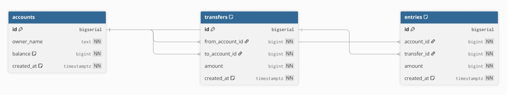

# Simple Banking System

## Overview
A minimal banking backend focused on **data consistency** and **concurrency safety**:
- Transfer money between accounts with **PostgreSQL transactions (ACID)**
- Prevent race conditions using **row-level locking**
- Reduce deadlock risk by **locking accounts in ascending ID order**
- Redis-based **rate limiting** middleware to mitigate API abuse

## Tech Stack
- Go
- Gin (HTTP framework)
- PostgreSQL 16 (database)
- Redis 7 (rate limiting)
- Docker / Docker Compose

---

## Features

### 1) Money Transfer (ACID)
- Transfer request executes inside a single DB transaction:
  - `BEGIN` → lock rows → validate balance → write transfer/entries → update balances → `COMMIT`
- If any step fails, transaction is rolled back (`ROLLBACK`)

### 2) Locking & Race Condition Prevention
- Uses `SELECT ... FOR UPDATE` to lock both account rows during transfer
- Prevents concurrent transfers from corrupting balances

### 3) Deadlock Reduction
- Always locks two accounts by **ascending account_id**
- Avoids the circular wait pattern common in “A→B” and “B→A” concurrent transfers

### 4) Redis Rate Limiting
- Redis counter-based limiter using `INCR + EXPIRE`
- Can be applied globally or per-route depending on how middleware is attached

### 5) Dockerized Deployment
- Runs `app + postgres + redis` via Docker Compose

---

## Database Schema



### Tables
**accounts**
- `id` (bigserial, PK)
- `owner_name` (text, not null)
- `balance` (bigint, not null, default 0)
- `created_at` (timestamptz, default now)

**transfers**
- `id` (bigserial, PK)
- `from_account_id` (FK → accounts.id)
- `to_account_id` (FK → accounts.id)
- `amount` (bigint, > 0)
- `created_at` (timestamptz, default now)

**entries** (ledger)
- `id` (bigserial, PK)
- `account_id` (FK → accounts.id)
- `transfer_id` (FK → transfers.id)
- `amount` (bigint, can be negative/positive)
- `created_at` (timestamptz, default now)

---

## Assignment Structure

```
simple-banking-system/
├── main.go                          # Composition root: init Postgres, Redis, Gin, middleware, routes
├── Dockerfile                       # Build/run Go service
├── docker-compose.yml              # Postgres + Redis + App orchestration
├── .env                            # Local environment variables (host=localhost)
├── .env.docker                     # Docker environment variables (host=postgres/redis)
├── go.mod / go.sum                 # Go module files
│
├── component/
│   ├── postgres/
│   │   └── postgres.go             # PostgreSQL connection helper (pgxpool)
│   ├── redis/
│   │   └── redis.go                # Redis connection helper
│   └── ratelimit/
│       └── limiter.go              # DDoS prevention using Redis (INCR + EXPIRE) by IP
│
└── module/
    └── account/
        ├── model/
        │   ├── account.go          # Entities (Clean Architecture)
        │   ├── transfer.go         # Transfer/Entry models + request validation
        │   └── errors.go           # Custom error definitions
        │
        ├── biz/
        │   ├── create_account.go   # Use Cases (Clean Architecture)
        │   ├── get_account.go      # Use case: get account
        │   ├── list_accounts.go    # Use case: list accounts
        │   └── transfer_money.go   # Use case: transfer money (calls tx store)
        │
        ├── storage/
        │   ├── sql.go              # SQL store + execTx helper
        │   ├── sql_account.go      # Account queries
        │   └── sql_transfer_tx.go  # Transfer transaction + locking + deadlock-safe ordering
        │
        └── transport/
            └── gin/
                ├── routes.go
                ├── create_account_handler.go
                ├── get_account_handler.go
                ├── list_accounts_handler.go
                ├── transfer_handler.go
                └── middleware/
                    └── rate_limit.go   # Gin middleware using Redis limiter
```


---

## Clean Architecture Layers

```
┌─────────────────────────────────────────────┐
│         Transport (Driver)                  │
│      module/account/transport/gin           │
└─────────────────────────────────────────────┘
                     │
                     ▼
┌─────────────────────────────────────────────┐
│         Storage (Adapters)                  │
│       module/account/storage                │
└─────────────────────────────────────────────┘
                     │
                     ▼
┌─────────────────────────────────────────────┐
│          Biz (Use-Case)                     │
│        module/account/biz                   │
└─────────────────────────────────────────────┘
                     │
                     ▼
┌─────────────────────────────────────────────┐
│         Models (Entities)                   │
│       module/account/model                  │
└─────────────────────────────────────────────┘
```